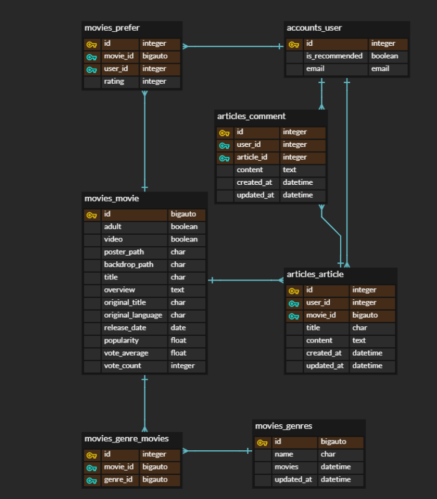

# 1학기 최종 프로젝트 : Back-End

## Back-End 서버 패키지

``django ``
``django-cors-headers ``
``djangorestframework ``
``djangorestframework-jwt``

---

## 1. 팀원 정보

김준영, 한건

## 2. 목표 서비스 구현 및 실제 구현 정도

백엔드에서는`` Django, Django-Rest-Framework, JWT``를 이용해서 REST API 서버를 구성하고, 

프론트엔드에서는 ``Vue, Vuex, Vue-Router``를 사용한 프론트엔드 서버를 구성하도록 했습니다.

목표 서비스는 유저가 가입 시 선호하거나 선호하지 않는 영화를 일정 개수 평가하고, 그 정보를 바탕으로 사용자가 선호할만한 영화를 추천받아 이에 대한 리뷰를 작성할 수 있는 영화 커뮤니티입니다.

저희가 목표로 했던 서비스 구현은 

- **유저의 영화 평가를 기반으로 한 영화 추천**
- **다수의 사용자들이 선호하는 영화 추천**
- **커뮤니티 기능(전체, 영화별, 평점별)**
- **리뷰에 대한 좋아요 기능**
- **프로필**

입니다.

이 중

- **유저의 영화 평가를 기반으로 한 영화 추천**
- **커뮤니티 기능(전체, 영화별)**

기능을 구현했습니다.

## 3. 데이터베이스 모델링

### Accounts 

#### User

- **email** : 실제 id의 역할을 하는 필드로 unique 옵션을 주었습니다.
- **username** : email이 실제 id의 역할을 하기 때문에 닉네임처럼 활용을 하려고 만들었습니다. (시간 관계상 프로필 구현을 못해 실제로 사용하지는 않았습니다)
- **is_superuser** : 관리자 페이지 링크를 띄울지 결정하는 필드로 프론트에서 이 필드값에 따라 관리자 페이지 라우터 링크를 띄울지 결정했습니다.
- **is_recommended** : 사용자가 초기에 받는 영화 추천을 받았는지 여부를 boolean으로 구분하는 필드로, default값은 False입니다. True가 되기 전에는 로그인시 선호하는 영화를 고르는 페이지만 사용 가능하도록 했습니다.
- **prefer_movies**(역참조) : M : N 관계 필드로 커스텀 중개 모델인 Prefer와 연결되어 있습니다. 유저가 평가한 영화의 목록을 prefer_movies 필드로 확인할 수 있고, 평점은 Prefer 중개모델에서 확인 가능합니다.

---

### Movies app

#### Movie

> TMDB에서 가져온 데이터를 필드이름으로 대부분 사용했습니다.

- **poster_path, backdrop_path** : 각각 메인 포스터와 가로로 긴 포스터 이미지 주소를 나타내는 CharField입니다.

- **title, overview**  : 각각 영화의 제목, 줄거리입니다.

- original_language, original_title : 각각 영화의 원래 언어, 원래 언어로 된 영화 제목입니다.

- **release_date** : 개봉일입니다.

- **popularity** : 인기도? 와 같은 필드로 추천 영화를 가져올 때 사용했습니다.

- **genres**(역참조) :  **M : N 필드**로 영화의 장르가 무엇인지에 대한 정보가 담겨 있습니다. 추천알고리즘에서 이를 활용해 추천 장르를 선택할 수 있도록 했습니다.

- **prefer_users** : **M : N 필드**로 이 영화를 평가한 유저들의 목록을 확인할 수 있는 필드입니다. 사용자에게 인기있는 영화를 구하는데 사용할 수 있으나 시간 관계상 구현하지는 못했습니다.

 ``vote_average, vote_count, adult, video`` 필드는 가져왔지만 실제로 사용하지 않았습니다.

#### Genre

- **name** : 장르의 이름을 나타내는 Char필드입니다.

- **movies** : **M : N 필드**로 이 장르에 포함된 영화의 목록을 확인할 수 있는 필드입니다.

#### Prefer

> 유저의 평가 정보를 저장하기 위해 커스텀 중개모델을 생성했습니다.

- **user** : 평가한 사용자의 id를 저장하는 필드로 ForeignKey 필드입니다.

- **movie** : 평가 영화의 id를 저장하는 필드로 ForeignKey 필드입니다.

- **rating** : 영화의 평가 점수를 저장하는 필드로 0~10의 값이 저장되는 Integer 필드입니다.

---

### Articles app

#### Article

> 영화에 대한 리뷰를 저장하는 모델입니다.

- **movie** : 어떤 영화에 대한 리뷰인지 나타내는 ForeignKey 필드입니다.
- **user** : 리뷰를 작성한 유저를 나타내는 ForeignKey 필드입니다.
- **title**, **content** : 각각 리뷰의 제목, 내용입니다.
- **created_at**, **updated_at** : 각각 리뷰의 생성 날짜, 수정 날짜입니다.

- **like_users** : 이 리뷰글에 좋아요 표시를 한 유저들을 확인할 수 있는 M:N 필드이지만 시간 관계상 실제로 구현하지 못했습니다.

#### Comment

> 리뷰 글에 대한 댓글을 저장하는  모델입니다.

- **article** : 댓글을 작성한 유저를 나타내는 ForeignKey 필드입니다.
- **user** : 댓글 작성자를 나타내는 ForeignKey 필드입니다.
- **content** : 댓글 내용입니다.

- **created_at**, **updated_at** : 각각 댓글의 생성 날짜, 수정 날짜입니다.

## 4. 필수 기능에 대한 설명

### A. 관리자 뷰

로그인 시 관리자 여부를 **is_superuser** 필드를 통해 확인하고, Admin 페이지 링크를 띄울 수 있도록 했습니다.

관리자 권한의 유저가 접속 시 DB를 조작할 수 있도록 모든 모델을 등록해 놓았으며, 장고에서 기본적으로 제공하는 admin 기능을 이용하여 구현했습니다.

### B. 추천 알고리즘

회원가입한 유저는 필수적으로 5개의 영화를 평가해야 합니다. 

시간 관계상 선호하는 영화만 고를 수 있도록 해 8점을 주도록 구현했지만, 본래는 영화에 대한 평점을 자유롭게 지정할 수 있게 구현하려고 했습니다.

유저는 각 영화에 대한 평점을 등록할 수 있습니다.

평점은 0~10 사이의 정수만 받을 수 있도록 했고 각 평점에 대한 가중치는 아래와 같습니다.

> 0 1 2 3 4 5 6 7 8 9 10
>
> -4 -3 -2 -2 -1 -1 0 1 2 3 4

6점을 기준으로 양수 음수가 나눠진 이유는, 제 개인적인 의견으로 7점부터가 영화에 대한 긍정적인 평가라고 생각했기 때문입니다. 선호하지 않는 영화에 대한 정보도 참고 할 수 있다면, 보다 정확한 추천 알고리즘 구현이 가능하다고 생각했기 때문에 평점 5점부터는 음수로 각각 가중치를 부여했습니다.

추천 장르를 고르는 방식의 구현으로, 영화에 대한 유저의 모든 평가를 가져온 뒤 그 영화의 평점에 따라 각 장르에 위에서 지정한 가중치를 더했습니다. 그리고 각 장르별로 가장 점수를 많이 얻은 세 장르를 고른 뒤 각 장르의 영화 리스트를 popularity 가 높은 순서대로 가져와서 제공했습니다.

## 5. 배포 서버 URL

시간 관계 상 구현한 기능을 따로 서버에 배포하지 못하였습니다.

## 6. 기타 (느낀점)

